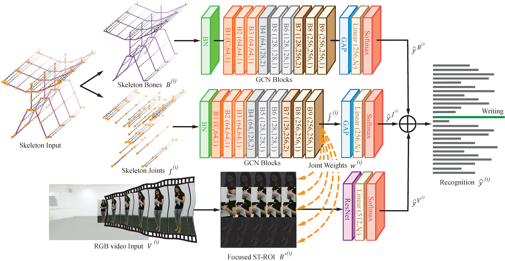

# MMNet
[](https://paperswithcode.com/sota/action-recognition-in-videos-on-ntu-rgbd?p=mmnet-a-model-based-multimodal-network-for)
[](https://paperswithcode.com/sota/action-recognition-in-videos-on-ntu-rgbd-120?p=mmnet-a-model-based-multimodal-network-for)
[](https://paperswithcode.com/sota/action-classification-on-toyota-smarthome?p=mmnet-a-model-based-multimodal-network-for)
[](https://paperswithcode.com/sota/skeleton-based-action-recognition-on-n-ucla?p=mmnet-a-model-based-multimodal-network-for)
[](https://paperswithcode.com/sota/action-recognition-in-videos-on-pku-mmd?p=mmnet-a-model-based-multimodal-network-for)

This repository holds the codebase, dataset and models for the work:

**MMNet: A Model-based Multimodal Network for Human Action Recognition in RGB-D Videos**
Bruce X.B. Yu, Yan Liu, Xiang Zhang, Sheng-hua Zhong, Keith C.C. Chan, TPAMI 2022 ([PDF](https://ieeexplore.ieee.org/document/9782511))

<div align="center">
    
</div>

## Abstract
<!--
This repository holds the codebase, dataset and models for the paper:
**Multimodal Fusion via Teacher-Student Network for Indoor Action Recognition**

update github version with below commands:
  git add .
  git add commit
  git push git@github.com:bruceyo/TSMF.git
-->

Human action recognition (HAR) in RGB-D videos has been widely investigated since the release of affordable depth sensors. Currently, unimodal approaches (e.g., skeleton-based and RGB video-based) have realized substantial improvements with increasingly larger datasets. However, model-based data fusion has seldom been investigated at the model level specifically. In this paper, we propose a model-based multimodal network (MMNet) that fuses skeleton and RGB modalities via a model-based approach. The objective is to improve ensemble recognition accuracy by effectively applying mutually complementary information from different data modalities. For the model-based fusion scheme, we use a spatiotemporal graph convolution network for the skeleton modality to learn attention weights that will be transferred to the network of the RGB modality. The whole model can be either individually or uniformly trained by the back-propagation algorithm in an end-to-end manner. Extensive experiments are conducted on four benchmark datasets: NTU RGB+D 60, NTU RGB+D 120, PKU-MMD, and Northwestern-UCLA Multiview. Upon aggregating the results of multiple modalities, our method is found to consistently outperform state-of-the-art approaches; thus, the proposed MMNet can effectively capture mutually complementary features in different RGB-D video modalities and provide more discriminative features for HAR.

## Prerequisites
- Python3 (>3.5)
- [PyTorch](http://pytorch.org/)
- [Openpose](https://github.com/CMU-Perceptual-Computing-Lab/openpose) **with** [Python API](https://github.com/CMU-Perceptual-Computing-Lab/openpose/blob/master/doc/installation.md#python-api). (Optional: for evaluation purpose)
- Other Python libraries can be installed by `pip install -r requirements.txt`

## Installation
``` shell
cd torchlight; python setup.py install; cd ..
```

## Data Preparation
### Datasets
#### NTU RGB+D 60
NTU RGB+D can be downloaded from [their website](http://rose1.ntu.edu.sg/datasets/actionrecognition.asp).
The **3D skeletons**(5.75GB) modality and the RGB modality are required in our experiments. After that, this command should be used to build the database for training or evaluation:
```
python tools/ntu60_gendata.py --data_path <path to nturgbd+d_skeletons>
```
where the ```<path to nturgbd+d_skeletons>``` points to the 3D skeletons modality of NTU RGB+D dataset you download.

Since the processed data is quite large (around 40.7G in total), we do not provide it here.

#### NTU RGB+D 120
NTU RGB+D 120 can be downloaded from [their website](http://rose1.ntu.edu.sg/datasets/actionrecognition.asp).
The **3D skeletons**(4.45GB) modality and the RGB modality are required in our experiments. After that, this command should be used to build the database for training or evaluation:
```
python tools/ntu120_gendata.py --data_path <path to nturgbd+d_skeletons>
```
where the ```<path to nturgbd+d_skeletons>``` points to the 3D skeletons modality of NTU RGB+D dataset you download.

Since the processed data is quite large (around 82G in total), we do not provide it here.

#### PKU-MMD
The dataset can be found in [PKU-MMD](https://github.com/ECHO960/PKU-MMD). PKU-MMD is a large action recognition dataset that contains 1076 long video sequences in 51 action categories, performed by 66 subjects in three camera views. It contains almost 20,000 action instances and 5.4 million frames in total. We transfer the 3D skeleton modality to seperate action repetition files with the command:
```
python tools/utils/skeleton_to_ntu_format.py
```
After that, this command should be used to build the database for training or evaluation:
```
python tools/pku_gendata.py --data_path <path to pku_mmd_skeletons>
```
where the ```<path to nturgbd+d_skeletons>``` points to the 3D skeletons modality of PKU-MMD dataset you processed with the above command.

For evaluation, the processed data includes: ```val_data and val_label``` are available from [GoogleDrive](https://drive.google.com/drive/folders/1iwsf1RP0a8rWLoh55kHlFibB3edQtd01?usp=sharing). Please manually put it in folder: ```./data/PKU_MMD```

#### Northwestern-UCLA Multiview
The Multiview 3D event dataset is capture by [Wangjian](http://wangjiangb.github.io/my_data.html) and Xiaohan Nie in UCLA. It contains RGB, depth and human skeleton data captured simultaneously by three Kinect cameras. This dataset include 10 action categories: pick up with one hand, pick up with two hands, drop trash, walk around, sit down, stand up, donning, doffing, throw, carry. Each action is performed by 10 actors. This dataset contains data taken from a variety of viewpoints.

The dataset can be found in [part-1](http://users.eecs.northwestern.edu/~jwa368/data/multiview_action.tgz.part-aa), [part-2](http://users.eecs.northwestern.edu/~jwa368/data/multiview_action.tgz.part-ab), [part-3](http://users.eecs.northwestern.edu/~jwa368/data/multiview_action.tgz.part-ac), [part-4](http://users.eecs.northwestern.edu/~jwa368/data/multiview_action.tgz.part-ad), [part-5](http://users.eecs.northwestern.edu/~jwa368/data/multiview_action.tgz.part-ae), [part-6](http://users.eecs.northwestern.edu/~jwa368/data/multiview_action.tgz.part-af), [part-7](http://users.eecs.northwestern.edu/~jwa368/data/multiview_action.tgz.part-ag), [part-8](http://users.eecs.northwestern.edu/~jwa368/data/multiview_action.tgz.part-ah), [part-9](http://users.eecs.northwestern.edu/~jwa368/data/multiview_action.tgz.part-ai), [part-10](http://users.eecs.northwestern.edu/~jwa368/data/multiview_action.tgz.part-aj), [part-11](http://users.eecs.northwestern.edu/~jwa368/data/multiview_action.tgz.part-ak), [part-12](http://users.eecs.northwestern.edu/~jwa368/data/multiview_action.tgz.part-al), [part-13](http://users.eecs.northwestern.edu/~jwa368/data/multiview_action.tgz.part-am), [part-14](http://users.eecs.northwestern.edu/~jwa368/data/multiview_action.tgz.part-an), [part-15](http://users.eecs.northwestern.edu/~jwa368/data/multiview_action.tgz.part-ao), [part-16](http://users.eecs.northwestern.edu/~jwa368/data/multiview_action.tgz.part-ap).

RGB videos could be downloaded from:  [RGB videos](http://users.eecs.northwestern.edu/~jwa368/data/multiview_action_videos.tgz), which is used to generate 2D skeleton data by using OpenPose.

### 2D Skeleton Retrieval from the RGB Video Input
After installed the Openpose tool, run
```
su
sh tools/openpose_skeleton_retrieval/2D_Retrieve_<dataset>.sh
```
where the ```<dataset>``` must be ```ntu_rgbd60```, ```ntu_rgbd120```, ```pku_mmd``` or ```nucla```, depending on the dataset you want to use. We also provide the retrieved OpenPose 2D skeleton data for both datasets, which could downloaded from [GoogleDrive (OpenPose NTU RGB+D 60)](https://drive.google.com/drive/folders/1cjG9aC5-GOXkTs2LfnW4IZi34LX9nMZ5?usp=sharing), [GoogleDrive (OpenPose NTU RGB+D 120)](https://drive.google.com/drive/folders/1CvRBBWgZsQtISapNbjxssn4vcIDoCg4S?usp=sharing), [GoogleDrive (OpenPose PKU-MMD)](https://drive.google.com/drive/folders/1AfIjkBVDyZRoMC4q4FLmGP35QUnkhhEJ?usp=sharing) and [GoogleDrive (OpenPose N-UCLA Multiview)](https://drive.google.com/file/d/1yE7shOrer0yeKuGpbU3mcyhNMnZxpa-D/view?usp=sharing).

### Prepare the RGB Modality
We provide our Matlab code used to convert RGB video to individual frames. You could have your own implementation via other programming languages.
Using our code, you can adapt the code in folder ```tools/rgb_video_2_frames``` to your environment by replacing the folder parameters (Lines 70 and 76 for NTU RGB+D datasets, and Lines 41 and 47 for PKU-MMD). For Northwestern-UCLA Multiview, it provides the RGB frames.

### Generate Region of Interest
```
python tools/data_gen/gen_fivefs_<dataset>
```
where the ```<dataset>``` must be ```ntu_rgbd``` or ```pku_mmd```, depending on the dataset you want to use.

The processed ROI of NTU-RGB+D is available from [GoogleDrive](https://drive.google.com/file/d/1NjLSNaJjR-XuSv3MmrQisFJTTg-Vc8ID/view?usp=sharing);
The processed ROI of PKU-MMD is available from [GoogleDrive](https://drive.google.com/file/d/1zHtjWF06mHjcMLsRhTIFiLPu9wpfoYs8/view?usp=sharing).

## Testing Pretrained Models
<!-- ### Evaluation
Once datasets and the pretrained models are ready, we can start the evaluation. -->
You may download the trained models reported in the paper via [GoogleDrive](https://drive.google.com/drive/folders/1DS_B7hj2QFLoI2l3--K-cRMX9YyTbIfu?usp=sharing) and put them in folder ```models```.
And also download the results reported in the paper via [GoogleDrive](https://drive.google.com/drive/folders/1_4T4XhCGu7qVx8EqIcXhSAm-y2lr5F14?usp=sharing) and put them in folder ```results```.


### Evaluate on NTU RGB+D 60
For evaluation in **NTU RGB+D 60**, run
```
python main_rgb_fused.py recognition -c config/ntu60_<evaluation protocol>/<evaluation protocol>/test_rgb_fused.yaml
```
where ```<evaluation protocol>``` is the evaluation protocol e.g., ```xsub``` and ```xview```.

Check the emsemble:
```
python ./ensemble/ensemble_ntu60.py --protocol <evaluation protocol>
```

### Evaluate on NTU RGB+D 120
For evaluation in **NTU RGB+D 120**, run
```
python main_rgb_fused.py recognition -c config/ntu120_<evaluation protocol>/test_rgb_fused.yaml
```
where ```<evaluation protocol>``` is the evaluation protocol e.g., ```xsub``` and ```xset```.

Check the emsemble:
```
python ./ensemble/ensemble_ntu120.py --protocol <evaluation protocol>
```

### Evaluate on PKU-MMD
For evaluation in **PKU-MMD**, run
```
python main_rgb_fused.py recognition -c config/pku_<evaluation protocol>/test_rgb_fused.yaml
```
where ```<evaluation protocol>``` is the evaluation protocol e.g., ```xsub``` and ```xview```.

Check the emsemble:
```
python ./ensemble/ensemble_pku.py --protocol <evaluation protocol>
```

### Evaluate on Northwestern-UCLA Multiview
For evaluation in **Northwestern-UCLA Multiview**, run
```
python main_rgb_fused.py recognition -c config/nucla_<evaluation protocol>/test_rgb_fused.yaml
```
where ```<evaluation protocol>``` is the evaluation protocol e.g., ```123```, ```132```, and ```231```.

Check the emsemble:
```
python ./ensemble/ensemble_nucla.py --protocol <evaluation protocol>
```

## Training
To train a new MMNet, you need to train submodels for three inputs: skeleton joint, skeleton bone, and RGB video.

For skeleton joint, run
```
python main_joint.py recognition -c config/<dataset>/train_joint.yaml [--work_dir <work folder>]
```
For skeleton bone, run
```
python main_bone.py recognition -c config/<dataset>/train_bone.yaml [--work_dir <work folder>]
```
For RGB video, run
```
python main_rgb_fused.py recognition -c config/<dataset>/train_rgb_fused.yaml [--work_dir <work folder>]
```
where the ```<dataset>``` must be ```ntu60_xsub```, ```ntu60_xview```, ```ntu120_xsub```, ```ntu120_xset```, ```pku_xsub```, ```pku_xview```, ```nucla_123```, ```nucla_132``` or ```nucla_231```, depending on the dataset you want to use.
The training results, including **model weights**, configurations and logging files, will be saved under the ```./work_dir``` by default or ```<work folder>``` if you appoint it.

You can modify the training parameters such as ```work_dir```, ```batch_size```, ```step```, ```base_lr``` and ```device``` in the command line or configuration files. The order of priority is:  command line > config file > default parameter. For more information, use ```main_rgb_fused.py -h```.

## Evaluation
Finally, custom model evaluation can be performed by the following commands:
For skeleton joint, run
```
python main_joint.py recognition -c config/<dataset>/test_joint.yaml [--work_dir <work folder>]
```
For skeleton bone, run
```
python main_bone.py recognition -c config/<dataset>/test_bone.yaml [--work_dir <work folder>]
```
For RGB video, run
```
python main_rgb_fused.py recognition -c config/<dataset>/test_rgb_fused.yaml --weights <path to model weights>
```
where the ```<dataset>``` must be ```ntu60_xsub```, ```ntu60_xview```, ```ntu120_xsub```, ```ntu120_xset```, ```pku_xsub```, ```pku_xview```, ```nucla_123```, ```nucla_132``` or ```nucla_231```, depending on the dataset you want to use.

## Ensemble Results in the Paper
After get the predictions from skeleton joint, skeleton bone, and the RGB video input, we can get the ensemble result by aggregating the results with the command:
```
python ./ensemble/ensemble_<dataset>.py --protocol <evaluation protocol>
```
where ```<dataset>``` is the name of a dataset, e.g., ```ntu60```, ```ntu120```, ```pku```, and ```nucla```;```<evaluation protocol>``` is the evaluation protocol provided by the corresponding dataset, e.g., ```xsub``` and ```xview``` for NTU-RGB+D.

## Acknowledgements
This repo is based on our previous repo
- [TSMF](https://github.com/bruceyo/TSMF)
and
- [ST-GCN](https://github.com/yysijie/st-gcn)
- [2s-AGCN](https://github.com/lshiwjx/2s-AGCN)
- [MS-G3D](https://github.com/kenziyuliu/MS-G3D)

Thanks to the original authors for their work!

## Citation
If you find this work is helpful, please cite our work:
```
@ARTICLE{9782511,
  author={Yu, Bruce X.B. and Liu, Yan and Zhang, Xiang and Zhong, Sheng-hua and Chan, Keith C.C.},
  journal={IEEE Transactions on Pattern Analysis and Machine Intelligence}, 
  title={MMNet: A Model-based Multimodal Network for Human Action Recognition in RGB-D Videos}, 
  year={2022},
  volume={},
  number={},
  pages={1-1},
  doi={10.1109/TPAMI.2022.3177813}
  }
```

## Contact
For any question, feel free to contact Bruce Yu: ```b r u c e x b y u AT gmail.com(remove space)```
